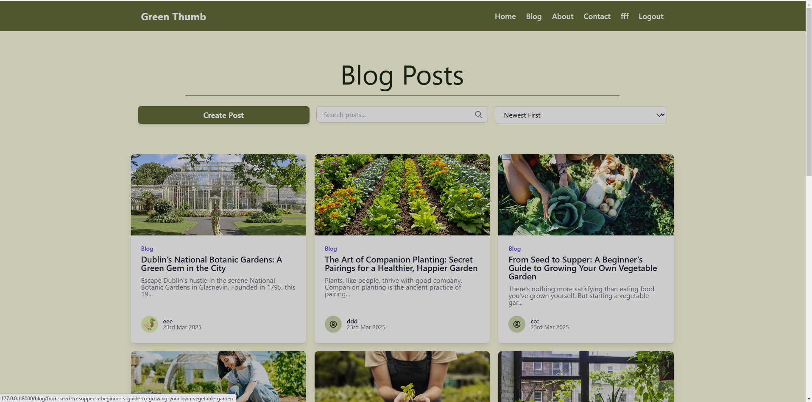
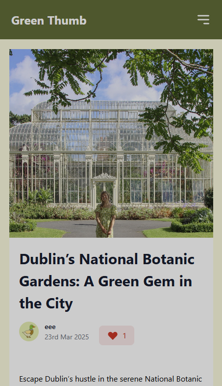
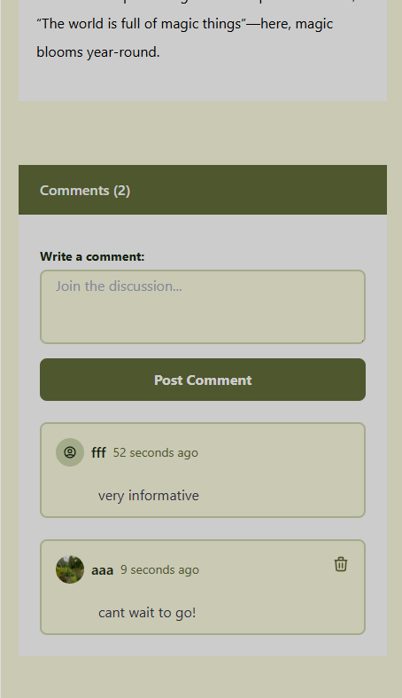
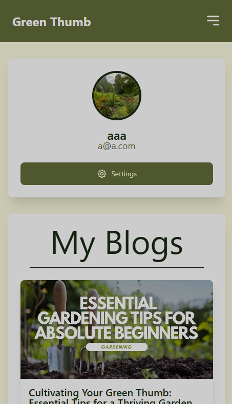
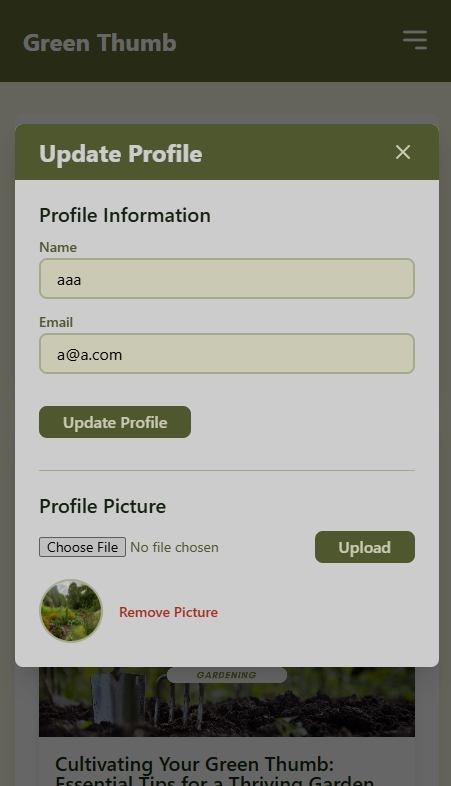
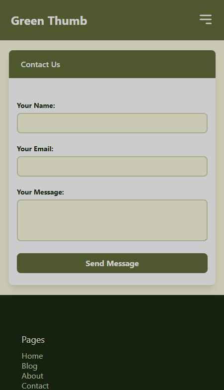
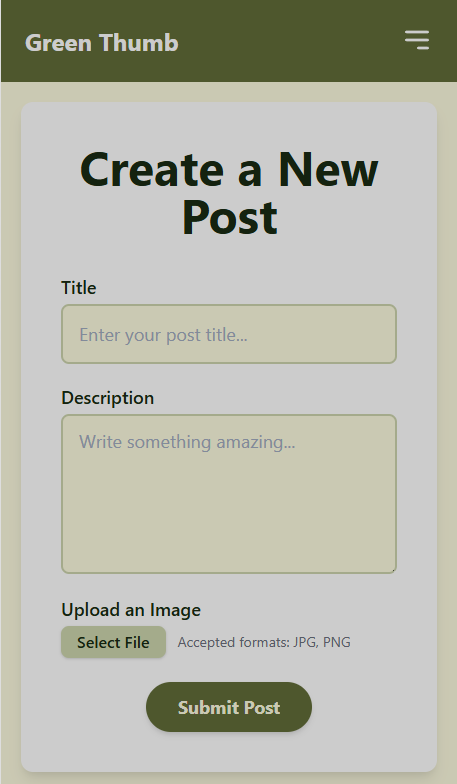
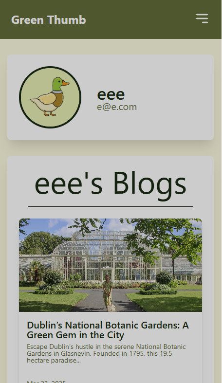

# GreenThumb Gardening Blog 🌱

[](https://laravel.com)
[](https://tailwindcss.com)
[](https://www.mysql.com)

A full-featured gardening blog platform built with Laravel, featuring blog posts, comments, likes, and user authentication.

---

## Features ✨

### 📝 Gardening Blog Posts

- Create/edit/delete blog posts
- Rich text content with image uploads
- Search and sort functionality

---

### 💬 Social Interaction Features
<div align="center" style="margin: 2rem 0">
  
  
</div>

- Post comments with real-time updates
- Like/unlike posts with instant feedback
- User profiles with customizable avatars

---

### 👤 User Management System
<div align="center" style="margin: 2rem 0">
  
  
</div>

- Secure authentication system
- Profile management dashboard
- Password reset functionality

---

### 📱 Responsive Design
<div align="center" style="margin: 2rem 0">
  
  
  
</div>

- Mobile friendly responsive design
- Adaptive layouts for all screen sizes
- Touch-friendly interactive components

---

## Technology Highlights
<div align="center">
  
  
  
</div>

---
## Getting Started 🚀

### Prerequisites
- PHP 8.1+
- Composer 2.5+
- Node.js 18+
- npm 9+
- MySQL 8.0+

### Installation
1. Clone the repository
```bash
https://github.com/shane-smyth/laravel_blog_ca2.git
cd laravel_blog_ca2

composer install
npm install

cp .env.example .env
php artisan key:generate
php artisan cache:clear && php artisan config:clear
php artisan serve
```


Create a database and update the .env file
``` 
DB_CONNECTION=mysql
DB_HOST=127.0.0.1
DB_PORT=3306
DB_DATABASE=laravelblog
DB_USERNAME={USERNAME}
DB_PASSWORD={PASSWORD}
```

Migrate the tables
```
php artisan migrate
```
